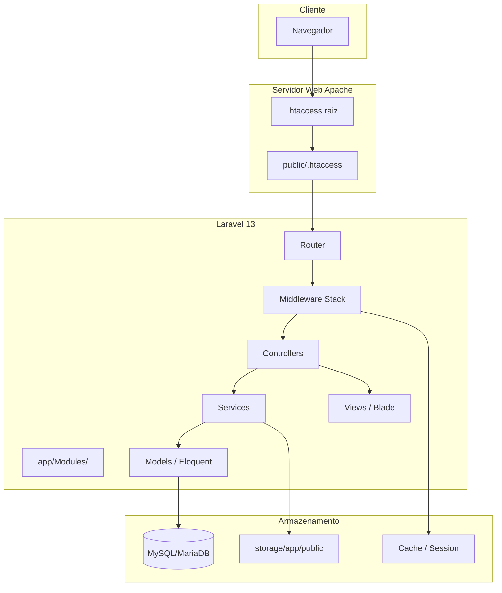
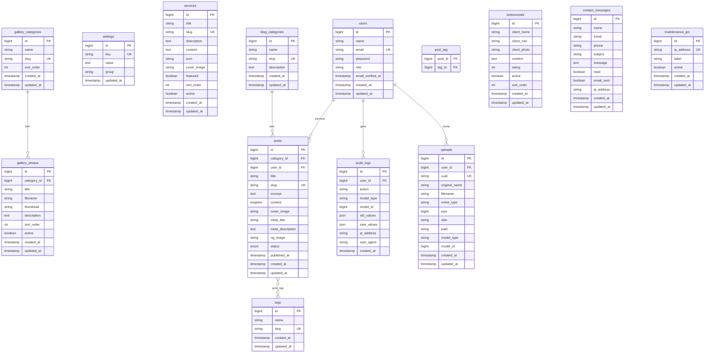
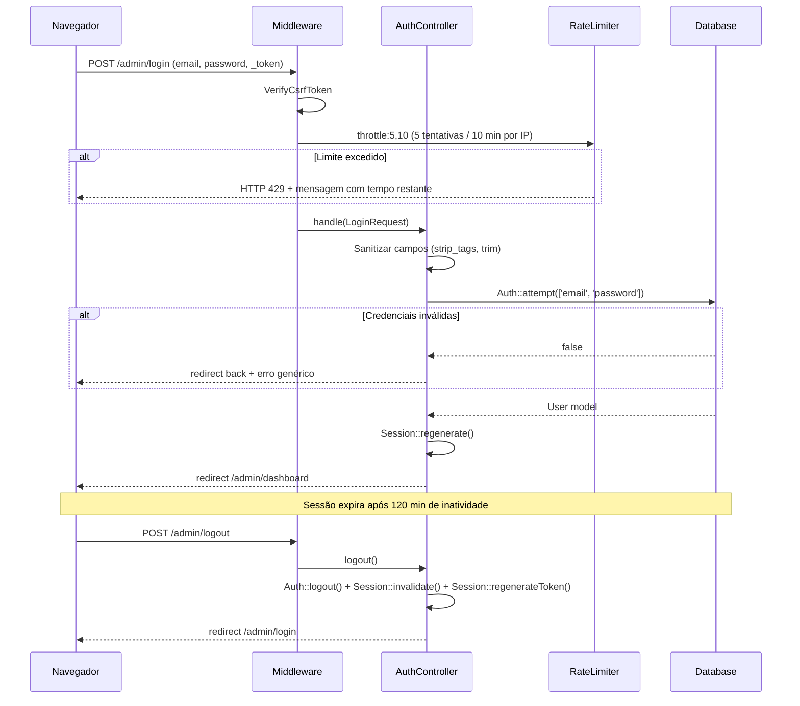
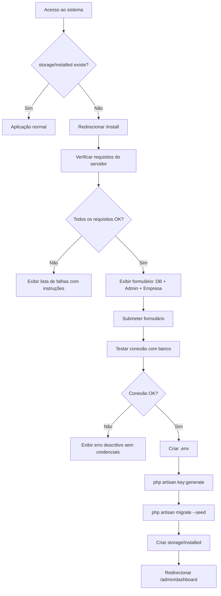
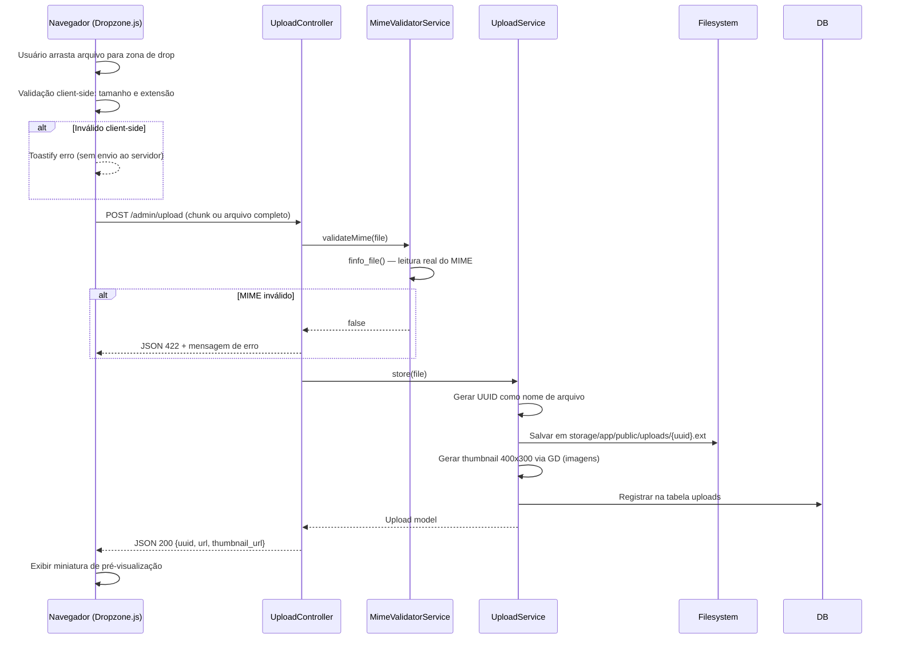

# Design Técnico — homemechanic-system

## Visão Geral

O **homemechanic** é uma aplicação web monolítica construída em Laravel 13 / PHP 8.4 com MySQL/MariaDB. O sistema é dividido em duas interfaces principais: o **Frontend** público (site institucional) e o **Painel Admin** (AdminLTE 4). A arquitetura segue o padrão modular com cada domínio funcional encapsulado em `app/Modules/{NomeModulo}`, registrado automaticamente via `ModuleServiceProvider`.

A paleta de cores é laranja (`#FF6B00`), preto (`#0D0D0D`), grafite (`#2C2C2C`) e branco (`#FFFFFF`).

---

## Arquitetura

### Visão de Alto Nível



### Camadas da Aplicação

| Camada | Responsabilidade |
|---|---|
| HTTP / Middleware | Rate limiting, CSRF, headers de segurança, manutenção, autenticação |
| Router | Rotas web (Frontend + Admin) e API (AJAX) por módulo |
| Controller | Orquestração de request → service → response |
| Service | Lógica de negócio isolada e testável |
| Model / Repository | Acesso a dados via Eloquent ORM |
| View / Blade | Renderização HTML (Frontend custom + AdminLTE 4) |

---

## Estrutura de Diretórios Modular

```
homemechanic/
├── app/
│   ├── Http/
│   │   ├── Middleware/
│   │   │   ├── SecurityHeaders.php
│   │   │   ├── MaintenanceMode.php
│   │   │   └── CheckInstalled.php
│   │   └── Kernel.php
│   ├── Modules/
│   │   ├── Installer/
│   │   │   ├── Controllers/InstallerController.php
│   │   │   ├── Services/InstallerService.php
│   │   │   ├── Requests/InstallRequest.php
│   │   │   └── Routes/web.php
│   │   ├── Auth/
│   │   │   ├── Controllers/AuthController.php
│   │   │   ├── Requests/LoginRequest.php
│   │   │   └── Routes/web.php
│   │   ├── Dashboard/
│   │   │   ├── Controllers/DashboardController.php
│   │   │   └── Routes/web.php
│   │   ├── Services/
│   │   │   ├── Controllers/ServiceController.php
│   │   │   ├── Models/Service.php
│   │   │   ├── Requests/ServiceRequest.php
│   │   │   ├── Resources/ServiceResource.php
│   │   │   └── Routes/web.php
│   │   ├── Gallery/
│   │   │   ├── Controllers/GalleryController.php
│   │   │   ├── Models/GalleryPhoto.php
│   │   │   ├── Models/GalleryCategory.php
│   │   │   ├── Services/ImageService.php
│   │   │   ├── Requests/GalleryRequest.php
│   │   │   ├── Resources/GalleryResource.php
│   │   │   └── Routes/web.php
│   │   ├── Blog/
│   │   │   ├── Controllers/PostController.php
│   │   │   ├── Controllers/CategoryController.php
│   │   │   ├── Models/Post.php
│   │   │   ├── Models/BlogCategory.php
│   │   │   ├── Models/Tag.php
│   │   │   ├── Services/SlugService.php
│   │   │   ├── Requests/PostRequest.php
│   │   │   ├── Resources/PostResource.php
│   │   │   └── Routes/web.php
│   │   ├── Testimonials/
│   │   │   ├── Controllers/TestimonialController.php
│   │   │   ├── Models/Testimonial.php
│   │   │   ├── Requests/TestimonialRequest.php
│   │   │   └── Routes/web.php
│   │   ├── Contact/
│   │   │   ├── Controllers/ContactController.php
│   │   │   ├── Models/ContactMessage.php
│   │   │   ├── Services/ContactService.php
│   │   │   ├── Requests/ContactRequest.php
│   │   │   └── Routes/web.php
│   │   ├── Settings/
│   │   │   ├── Controllers/SettingsController.php
│   │   │   ├── Controllers/SmtpController.php
│   │   │   ├── Models/Setting.php
│   │   │   ├── Services/SmtpService.php
│   │   │   ├── Requests/SmtpRequest.php
│   │   │   └── Routes/web.php
│   │   ├── Maintenance/
│   │   │   ├── Controllers/MaintenanceController.php
│   │   │   ├── Models/MaintenanceIp.php
│   │   │   └── Routes/web.php
│   │   ├── Upload/
│   │   │   ├── Controllers/UploadController.php
│   │   │   ├── Services/UploadService.php
│   │   │   ├── Services/MimeValidatorService.php
│   │   │   └── Routes/web.php
│   │   └── Frontend/
│   │       ├── Controllers/HomeController.php
│   │       ├── Controllers/FrontBlogController.php
│   │       ├── Controllers/FrontGalleryController.php
│   │       └── Routes/web.php
│   ├── Providers/
│   │   └── ModuleServiceProvider.php
│   └── Policies/
│       ├── PostPolicy.php
│       ├── GalleryPolicy.php
│       └── ServicePolicy.php
├── resources/
│   ├── views/
│   │   ├── layouts/
│   │   │   ├── admin.blade.php
│   │   │   └── frontend.blade.php
│   │   ├── errors/
│   │   │   ├── 403.blade.php
│   │   │   ├── 404.blade.php
│   │   │   ├── 419.blade.php
│   │   │   ├── 429.blade.php
│   │   │   ├── 500.blade.php
│   │   │   └── 503.blade.php
│   │   └── modules/
│   │       ├── installer/
│   │       ├── auth/
│   │       ├── dashboard/
│   │       ├── services/
│   │       ├── gallery/
│   │       ├── blog/
│   │       ├── contact/
│   │       ├── settings/
│   │       ├── maintenance/
│   │       └── frontend/
│   └── modules/
│       ├── gallery/
│       │   ├── css/gallery.css
│       │   └── js/gallery.js
│       ├── blog/
│       │   └── js/blog.js
│       └── upload/
│           └── js/uploader.js
├── database/
│   ├── migrations/
│   └── seeders/
├── storage/
│   ├── app/public/uploads/
│   └── installed          ← criado pelo Instalador
├── .htaccess              ← redireciona para public/
└── public/
    └── .htaccess          ← regras Laravel mod_rewrite
```

---

## Componentes e Interfaces

### ModuleServiceProvider

Responsável por descobrir e registrar automaticamente todos os módulos:

```php
// app/Providers/ModuleServiceProvider.php
class ModuleServiceProvider extends ServiceProvider
{
    public function boot(): void
    {
        $modulesPath = app_path('Modules');
        foreach (glob("{$modulesPath}/*/Routes/web.php") as $routeFile) {
            Route::middleware('web')->group($routeFile);
        }
        foreach (glob("{$modulesPath}/*/Routes/api.php") as $routeFile) {
            Route::middleware('api')->prefix('api')->group($routeFile);
        }
    }
}
```

### Middleware Stack (ordem de execução)

```
CheckInstalled → MaintenanceMode → SecurityHeaders → StartSession → VerifyCsrfToken → Authenticate
```

### SecurityHeaders Middleware

Injeta os cabeçalhos HTTP de segurança em todas as respostas:

```
X-Frame-Options: DENY
X-Content-Type-Options: nosniff
X-XSS-Protection: 1; mode=block
Referrer-Policy: strict-origin-when-cross-origin
```

### CheckInstalled Middleware

```
IF storage/installed NÃO existe AND rota atual NÃO é /install*
    → redirecionar para /install
IF storage/installed EXISTE AND rota atual É /install*
    → redirecionar para /
```

### SmtpService

Atualiza as configurações de e-mail do Laravel em tempo de execução sem reiniciar o servidor:

```php
Config::set('mail.mailers.smtp.host', $settings->smtp_host);
Config::set('mail.mailers.smtp.port', $settings->smtp_port);
// ... demais campos
Mail::purge('smtp'); // limpa instância cacheada
```

---

## Modelos de Dados

### Diagrama Entidade-Relacionamento



### Tabela `settings` — Chaves Principais

| key | group | descrição |
|---|---|---|
| `site_name` | general | Nome do site |
| `site_logo` | general | Caminho do logotipo |
| `site_favicon` | general | Caminho do favicon |
| `site_description` | seo | Meta description global |
| `smtp_host` | smtp | Host SMTP |
| `smtp_port` | smtp | Porta SMTP |
| `smtp_encryption` | smtp | TLS / SSL / none |
| `smtp_username` | smtp | Usuário SMTP |
| `smtp_password` | smtp | Senha SMTP (criptografada) |
| `smtp_from_address` | smtp | E-mail remetente |
| `smtp_from_name` | smtp | Nome remetente |
| `maintenance_mode` | maintenance | 0 ou 1 |
| `maintenance_message` | maintenance | Mensagem customizada |
| `maintenance_eta` | maintenance | Estimativa de retorno |

---

## Fluxo de Autenticação e Segurança



### Política de Senhas

- Algoritmo: `bcrypt` com `cost = 12`
- Configurado em `config/hashing.php`: `'bcrypt' => ['rounds' => 12]`

### Proteção CSRF

- Token injetado em todos os formulários via `@csrf`
- Requisições AJAX incluem header `X-CSRF-TOKEN` lido do meta tag
- Resposta 419 retorna JSON `{"message": "CSRF token mismatch"}` sem detalhes de sessão

---

## Design do Instalador



### Verificações de Requisitos

| Requisito | Verificação |
|---|---|
| PHP >= 8.4 | `version_compare(PHP_VERSION, '8.4.0', '>=')` |
| pdo_mysql | `extension_loaded('pdo_mysql')` |
| mbstring | `extension_loaded('mbstring')` |
| openssl | `extension_loaded('openssl')` |
| tokenizer | `extension_loaded('tokenizer')` |
| xml | `extension_loaded('xml')` |
| ctype | `extension_loaded('ctype')` |
| json | `extension_loaded('json')` |
| bcmath | `extension_loaded('bcmath')` |
| fileinfo | `extension_loaded('fileinfo')` |
| gd | `extension_loaded('gd')` |
| mod_rewrite | `apache_get_modules()` ou detecção via `$_SERVER` |
| storage/ gravável | `is_writable(storage_path())` |
| bootstrap/cache/ gravável | `is_writable(base_path('bootstrap/cache'))` |

---

## Design do Sistema de Upload



### Configuração Dropzone.js

```javascript
const dropzone = new Dropzone('#upload-zone', {
    url: '/admin/upload',
    maxFilesize: 100,          // MB (validação server-side define por tipo)
    acceptedFiles: 'image/jpeg,image/png,image/webp,image/gif,video/mp4,video/webm',
    parallelUploads: 3,
    addRemoveLinks: true,
    headers: { 'X-CSRF-TOKEN': document.querySelector('meta[name="csrf-token"]').content },
    init() {
        this.on('uploadprogress', (file, progress, bytesSent) => {
            // Atualiza barra de progresso e tempo restante estimado
        });
        this.on('success', (file, response) => {
            Toastify({ text: 'Upload concluído!', style: { background: '#28a745' } }).showToast();
        });
        this.on('error', (file, message) => {
            Toastify({ text: message, style: { background: '#dc3545' } }).showToast();
        });
    }
});
```

### Cálculo de Tempo Restante

```
velocidade = bytesSent / tempoDecorrido (bytes/s)
bytesRestantes = file.size - bytesSent
tempoRestante = bytesRestantes / velocidade (segundos)
```

---

## Design do Frontend e Admin

### Frontend Público

Estrutura de páginas e componentes:

```
/ (Home)
├── #hero          — Banner principal com CTA animado
├── #services      — Cards de serviços com scroll animation (IntersectionObserver)
├── #gallery       — Preview da galeria com link para /galeria
├── #testimonials  — Carrossel de depoimentos (CSS puro ou Swiper.js)
└── #contact       — Formulário de contato AJAX

/sobre             — Página institucional
/servicos          — Listagem completa de serviços
/galeria           — Galeria com filtro por categoria
/blog              — Listagem de posts (9/página)
/blog/{slug}       — Post individual com posts relacionados
/contato           — Formulário de contato
/politica-privacidade
```

#### Paleta e Tipografia

```css
:root {
    --color-primary:    #FF6B00;  /* laranja */
    --color-dark:       #0D0D0D;  /* preto */
    --color-graphite:   #2C2C2C;  /* grafite */
    --color-white:      #FFFFFF;
    --color-primary-hover: #E55A00;
    --font-heading: 'Rajdhani', sans-serif;   /* esportivo */
    --font-body:    'Inter', sans-serif;
}
```

#### Preloader

```html
<div id="preloader">
    
    <div class="preloader-bar"><span></span></div>
</div>
<script>
    window.addEventListener('load', () => {
        document.getElementById('preloader').classList.add('hidden');
    });
</script>
```

### Painel Admin (AdminLTE 4)

Layout base com customização de cores:

```scss
// resources/sass/admin-custom.scss
$primary: #FF6B00;
$dark:    #0D0D0D;
$sidebar-bg: #1A1A1A;
$sidebar-color: #CCCCCC;
$sidebar-hover-bg: #FF6B00;
```

#### Dashboard — Cards de Resumo

| Card | Ícone | Cor | Dado |
|---|---|---|---|
| Total de Serviços | `bi-tools` | laranja | `Service::count()` |
| Posts do Blog | `bi-newspaper` | grafite | `Post::published()->count()` |
| Fotos na Galeria | `bi-images` | preto | `GalleryPhoto::count()` |
| Mensagens não lidas | `bi-envelope` | vermelho | `ContactMessage::unread()->count()` |

---

## Configurações de Servidor (.htaccess)

### Raiz do Projeto (`/.htaccess`)

```apache
<IfModule mod_rewrite.c>
    RewriteEngine On
    RewriteRule ^(.*)$ public/$1 [L]
</IfModule>
```

### Pasta Public (`/public/.htaccess`)

```apache
<IfModule mod_rewrite.c>
    <IfModule mod_negotiation.c>
        Options -MultiViews -Indexes
    </IfModule>

    RewriteEngine On

    # Redirecionar HTTPS
    RewriteCond %{HTTPS} off
    RewriteRule ^ https://%{HTTP_HOST}%{REQUEST_URI} [L,R=301]

    # Bloquear acesso a arquivos ocultos
    RewriteRule ^\.env - [F,L]
    RewriteRule ^storage/installed - [F,L]

    # Handle Authorization Header
    RewriteCond %{HTTP:Authorization} .
    RewriteRule .* - [E=HTTP_AUTHORIZATION:%{HTTP:Authorization}]

    # Redirect Trailing Slashes
    RewriteCond %{REQUEST_FILENAME} !-d
    RewriteCond %{REQUEST_URI} (.+)/$
    RewriteRule ^ %1 [L,R=301]

    # Send Requests To Front Controller
    RewriteCond %{REQUEST_FILENAME} !-d
    RewriteCond %{REQUEST_FILENAME} !-f
    RewriteRule ^ index.php [L]
</IfModule>

# Segurança: cabeçalhos adicionais via Apache
<IfModule mod_headers.c>
    Header always set X-Frame-Options "DENY"
    Header always set X-Content-Type-Options "nosniff"
    Header always set X-XSS-Protection "1; mode=block"
    Header always set Referrer-Policy "strict-origin-when-cross-origin"
</IfModule>

# Compressão Gzip
<IfModule mod_deflate.c>
    AddOutputFilterByType DEFLATE text/html text/css application/javascript application/json
</IfModule>

# Cache de assets estáticos
<IfModule mod_expires.c>
    ExpiresActive On
    ExpiresByType image/jpeg "access plus 1 year"
    ExpiresByType image/png  "access plus 1 year"
    ExpiresByType image/webp "access plus 1 year"
    ExpiresByType text/css   "access plus 1 month"
    ExpiresByType application/javascript "access plus 1 month"
</IfModule>
```

---

## Tratamento de Erros

### Páginas de Erro Personalizadas

Cada página de erro herda o layout `frontend.blade.php` e exibe:

| Código | Mensagem | Ação |
|---|---|---|
| 403 | Acesso negado | Link para Home |
| 404 | Página não encontrada | Link para Home + sugestões |
| 419 | Sessão expirada | Botão para recarregar |
| 429 | Muitas tentativas | Tempo restante de bloqueio |
| 500 | Erro interno | Mensagem genérica (log completo no Laravel) |
| 503 | Em manutenção | Mensagem + estimativa de retorno |

### Handler de Exceções

```php
// app/Exceptions/Handler.php
public function register(): void
{
    $this->renderable(function (Throwable $e, Request $request) {
        if ($request->expectsJson()) {
            return response()->json([
                'message' => $this->getPublicMessage($e),
            ], $this->getStatusCode($e));
        }
    });
}
```

### Erro 500 — Política de Log

- Log completo (stack trace, contexto) gravado em `storage/logs/laravel.log`
- Visitante recebe apenas: `"Ocorreu um erro interno. Nossa equipe foi notificada."`
- Em produção: `APP_DEBUG=false`

---

## Estratégia de Testes

### Abordagem Dual

O sistema utiliza dois tipos complementares de testes:

- **Testes de unidade/exemplo**: verificam comportamentos específicos, casos de borda e integrações pontuais
- **Testes baseados em propriedades (PBT)**: verificam propriedades universais que devem valer para qualquer entrada válida

### Biblioteca PBT

Para PHP 8.4 / Laravel 13, será utilizado o **[eris](https://github.com/giorgiosironi/eris)** (ou **[PhpQuickCheck](https://github.com/steos/php-quickcheck)**) para property-based testing. Cada propriedade é executada com mínimo de **100 iterações**.

### Formato de Tag

Cada teste de propriedade deve ser anotado com:
```
Feature: homemechanic-system, Property {N}: {texto da propriedade}
```

### Cobertura por Módulo

| Módulo | Tipo de Teste |
|---|---|
| Installer | Exemplo + Propriedade (verificação de requisitos) |
| Auth / Rate Limiter | Propriedade (contagem de tentativas) |
| Slug Service | Propriedade (unicidade, round-trip) |
| Upload / MIME Validator | Propriedade (rejeição de tipos inválidos) |
| Settings / SMTP | Exemplo (configuração e persistência) |
| Frontend / Views | Snapshot + Exemplo |
| Audit Log | Propriedade (completude do registro) |
| Maintenance | Propriedade (controle por IP) |


---

## Propriedades de Corretude

*Uma propriedade é uma característica ou comportamento que deve ser verdadeiro em todas as execuções válidas do sistema — essencialmente, uma declaração formal sobre o que o sistema deve fazer. As propriedades servem como ponte entre especificações legíveis por humanos e garantias de corretude verificáveis por máquina.*

### Propriedade 1: Verificação de Requisitos Reflete Estado Real

*Para qualquer* subconjunto de extensões PHP "instaladas" fornecido como entrada, a função `InstallerService::checkRequirements()` deve retornar exatamente as extensões ausentes como falhas — nem mais, nem menos.

**Valida: Requisito 1.2**

---

### Propriedade 2: Mensagem de Erro de Instalação Não Expõe Credenciais

*Para qualquer* combinação de credenciais de banco de dados inválidas (host, porta, usuário, senha), a mensagem de erro retornada pelo `InstallerService` não deve conter a senha fornecida como substring.

**Valida: Requisito 1.5**

---

### Propriedade 3: Middleware de Instalação Bloqueia Acesso Após Conclusão

*Para qualquer* rota do namespace `/install/*`, quando o arquivo `storage/installed` existe, o middleware `CheckInstalled` deve redirecionar a requisição para `/` independentemente do método HTTP ou parâmetros da requisição.

**Valida: Requisito 1.7**

---

### Propriedade 4: Rate Limiter Bloqueia Após N Tentativas Inválidas

*Para qualquer* endereço IP e qualquer sequência de N tentativas de login com credenciais inválidas onde N ≥ 5, a N+1ª tentativa dentro da janela de 10 minutos deve retornar HTTP 429 com uma mensagem contendo o tempo restante de bloqueio.

**Valida: Requisito 2.3**

---

### Propriedade 5: Sanitização Remove Todas as Tags HTML da Entrada

*Para qualquer* string de entrada fornecida ao `Sanitizador` (incluindo strings com tags HTML, scripts, atributos de evento e entidades HTML), a saída sanitizada não deve conter nenhuma tag HTML — ou seja, `strip_tags(output) === output`.

**Valida: Requisitos 2.5, 14.1**

---

### Propriedade 6: Hash de Senha é Round-Trip Verificável com Custo 12

*Para qualquer* string de senha não vazia, `Hash::make($password)` deve produzir um hash bcrypt com fator de custo 12 tal que `Hash::check($password, $hash) === true` e o hash nunca seja igual à senha original.

**Valida: Requisito 2.7**

---

### Propriedade 7: Cabeçalhos de Segurança Presentes em Toda Resposta HTTP

*Para qualquer* rota registrada no sistema (Frontend ou Admin), a resposta HTTP deve conter todos os quatro cabeçalhos de segurança obrigatórios: `X-Frame-Options: DENY`, `X-Content-Type-Options: nosniff`, `X-XSS-Protection: 1; mode=block` e `Referrer-Policy: strict-origin-when-cross-origin`.

**Valida: Requisito 2.9**

---

### Propriedade 8: Validação de Upload Rejeita Arquivos Inválidos por MIME e Tamanho

*Para qualquer* arquivo cujo tipo MIME real (detectado via `finfo_file()`) não pertença ao conjunto `{image/jpeg, image/png, image/webp, image/gif, video/mp4, video/webm}`, ou cujo tamanho exceda o limite configurado para o tipo (10MB para imagens, 100MB para vídeos), o `MimeValidatorService` deve retornar `false` e o `UploadController` deve retornar HTTP 422 — independentemente da extensão do arquivo no nome original.

**Valida: Requisitos 5.3, 5.4, 5.5, 14.4**

---

### Propriedade 9: Slugs de Posts São Únicos Para Qualquer Sequência de Títulos

*Para qualquer* sequência de N títulos de posts (incluindo títulos idênticos repetidos), o `SlugService` deve gerar N slugs todos distintos entre si, onde cada slug é URL-safe (apenas letras minúsculas, dígitos e hífens) e derivado do título correspondente.

**Valida: Requisitos 7.3, 7.4**

---

### Propriedade 10: Modo de Manutenção Respeita Lista de IPs Permitidos

*Para qualquer* endereço IP e qualquer lista de IPs permitidos configurada, quando o modo de manutenção está ativo, o middleware `MaintenanceMode` deve liberar o acesso se e somente se o IP da requisição pertence à lista de IPs permitidos — e bloquear com HTTP 503 caso contrário.

**Valida: Requisito 10.3**

---

### Propriedade 11: Audit Log Registra Todas as Ações Administrativas Críticas

*Para qualquer* ação CRUD administrativa (criar, editar ou excluir qualquer recurso do painel), um registro deve ser criado na tabela `audit_logs` contendo: `user_id` não nulo, `action` não vazia, `model_type` não vazio, `ip_address` não vazio e `created_at` com timestamp da operação.

**Valida: Requisito 14.3**

---

### Propriedade 12: Requisição AJAX com CSRF Inválido Retorna 419 JSON Sem Dados de Sessão

*Para qualquer* requisição de escrita AJAX (POST, PUT, DELETE) com token CSRF ausente ou inválido, a resposta deve ser HTTP 419 com `Content-Type: application/json`, contendo apenas `{"message": "..."}` — sem incluir identificadores de sessão, dados do usuário ou stack traces.

**Valida: Requisito 14.6**

---

### Propriedade 13: Senha SMTP Armazenada é Sempre Diferente do Valor Original

*Para qualquer* string de senha SMTP fornecida ao `SmtpService::saveSettings()`, o valor persistido na tabela `settings` para a chave `smtp_password` deve ser diferente da senha original, e `Crypt::decryptString(stored_value)` deve retornar exatamente a senha original.

**Valida: Requisito 9.5**

